<!--
  Profile README. For this to appear on your GitHub profile, the repo
  containing it must be PUBLIC and named EXACTLY your GitHub username.
  Full instructions in HOW-TO.md.
-->

<picture>
  <source media="(prefers-color-scheme: dark)" srcset="assets/header-dark.svg">
  <source media="(prefers-color-scheme: light)" srcset="assets/header-light.svg">
  
</picture>

  <samp>Distributed systems / Low latency systems / Consumer applications / Whitelabel platforms</samp>

 

### Selected work

| Project | What it is | Where |
|:--|:--|:--|
| **globe.li** | News-to-trade terminal integrates Hyperliquid, Polymarket, Limitless and Aster. 1M+ MAU; #1 of 569 on pm.wiki. | [`globe.li`](https://globe.li) |
| **pro.** | In-browser design / think / code / plan / collab suite: brainstorm to deployed app in one typed pipeline. | [`pro.dfurrer.com`](https://pro.dfurrer.com) |
| **perps.studio x hip4.dev** | First market on testnet, first SDK shipped, first whitelabel platform, first market on mainnet. SDKs open-sourced in [TypeScript](https://www.npmjs.com/package/@perps/hip4), [Rust](https://github.com/perps-studio/hip-4-rust), [Python](https://github.com/perps-studio/hip-4-python) and [Go](https://github.com/perps-studio/hip4-go). | [`perps.studio`](https://perps.studio) / [`hip4.dev`](https://hip4.dev) |
| **outcome.xyz** | HIP-4 prediction markets on Hyperliquid. #1 builder on hyperliquid. | [`outcome.xyz`](https://outcome.xyz) |
| **laptime.dev** | Performance analysis for pros. Security, SEO, privacy, connectivity included. With browser ext. & CI. | [`laptime.dev`](https://laptime.dev) |
| **builder.markets** | Merged order book, best-execution routing across six venues. | [`app.builder.markets`](https://app.builder.markets) |
| **parlayer.xyz** | Multi-venue parlay aggregator: copula pricing, hard solvency invariant. | [`parlayer.xyz`](https://parlayer.xyz) |
| … | A few dozen more from 2026. | [`dfurrer.com`](https://dfurrer.com) |

---

  <samp><a href="https://dfurrer.com">dfurrer.com</a></samp>
  <!-- add socials here if you like, e.g. <a href="https://x.com/yourhandle">@yourhandle</a> -->

